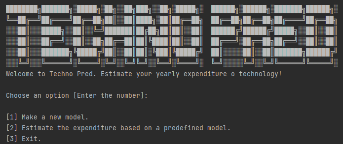

# BDT-2022 | Group No. 17
#### We call it Techno Pred!
The aim of this project [call it Techno Pred] is to design and implement a big data system for estimating annual expenditure on technology of single individuals based on their socio-demographic data. Socio-demographics relate to a combination of social and demographic aspects that define people in a specific group or population. The core idea is that different socio-demographic factors affect the reasons why a customer chooses to invest in technological products and services, and the amount of money invested.
## Requierments
In this project the fiollowing
- Python version>=2.7
  - PySpark
  - PyMongo
  - requests
  - Pandas
  - findspark
- MongoDB Alas
- spark-3.3.0_hadoop2
- Stable Internet connection!


## Logical Pipeline
Logical pipeline for this project shown in the below chart. In this pipeline we have two main paths based on the given task by the user. First ath which is followed by the blue path is for making a new model. And the green path(!) is for using a made model for estimation.


**How it works?**

In the first path (making a new model), after importing the data sets to the pipeline, data will be ingested by the ingestion module. Ingestion module will remove unnecessary variables from the data set based on the user and system constraints (e.g. anonymisation), and in the next step the data will be stored in our database.

Aslo to make the system faster we pass one copy of the ingested data directly to the transforming section. The difference for the second path is that we don't need to save the information in our database.

To continue the first path we path the data to the transforming part to prepare the data for machine learning in spark. In the next steps the model will be created and the new data can be estimated by the model that had been made in the previous step. Moreover, an API connection is provided that enables the user to change the currency based on currency rate exchange. At the end, the outcome can be shown on the interface.

As it can be seen for the second path we do not save the data in the database, the pipeline just ingest the data and pass the ingested data to the transforming and estimation part. The estimation part will load the chosen model and estimate the expenditures.


## How to Run?
Simply run the main.y by python compiler
```
python main.py
```



## Future potentioal Improvements
There are some suggestions for future improvement in this project:
- Improve error handling
- Expand the new type of inputs (datasets from sql etc.)
- Develop the web interface
- Develop an API for giving the expenditure estimation service.
- Developing a module that can gather the data and make a suitable dataset

