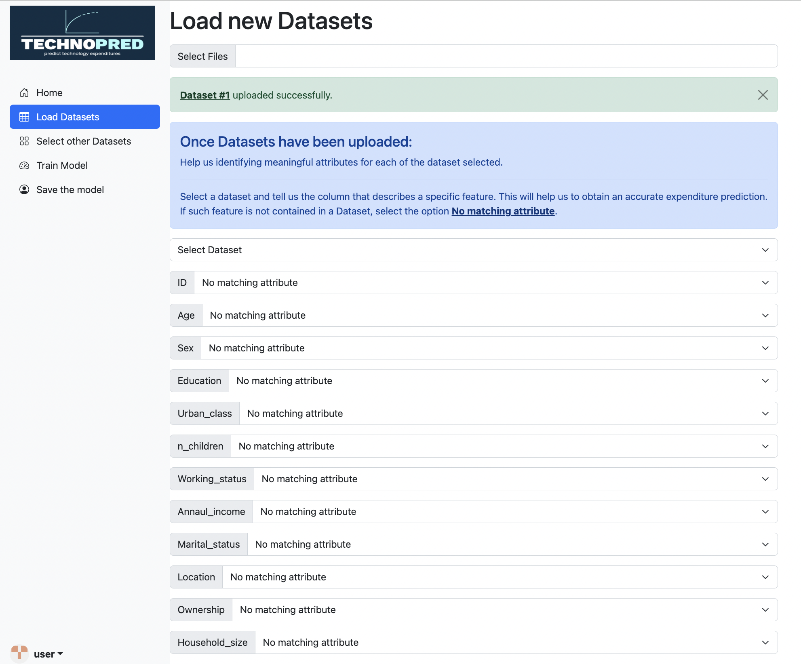
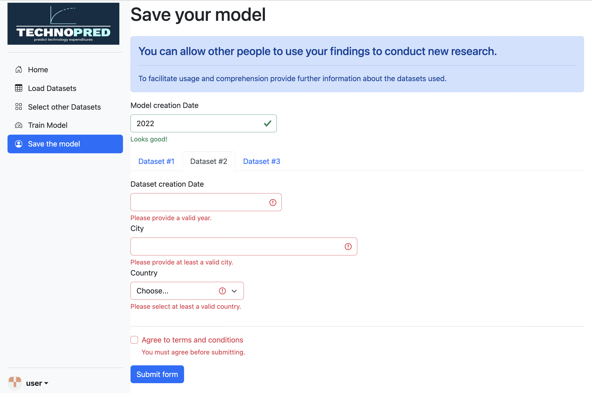

After the completion of the system, we created a prototype of a possible web interface that allowed us to make the program we created more user-friendly. First of all, we developed a recognizable logo that conveys a perception about the service we provide.

Lately,  we focused on developing a web interface that aims to make the user's interaction as simple and efficient as possible. We think that our prototype could improve the overall understanding of the design. We decided to display some focal points of the system we implemented, namely the steps in which the user has to load the datasets and the final step in which it can save the model fitted to share it to future users (also providing further information that allows to improve user understanding).

